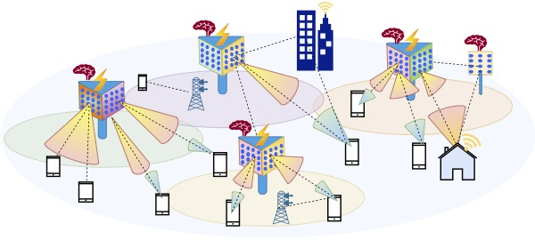
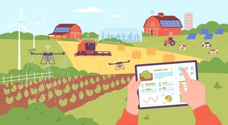

<!--Our research lies at the intersection of next-generation wireless networks, wireless
sensing, and smart device systems. We are particularly interested in creating agile, adaptable, smart, secure, and
scalable wireless systems with an emphasis on millimeter-wave (mmWave) and Terahertz (THz) networks,
providing a solution that exploits the large swath of the spectrum flexibly and incorporates novel
node architectures with unexplored devices and systems. We strive to combine theory and real-world hardware implementation and experimental evaluation to motivate, develop, and validate our research, with the hope of impacting real-world wireless systems. The research is multi-disciplinary, cutting across electromagnetics and antennas to protocol design, algorithm, signal processing, and end-to-end systems.-->
Our research lies at the intersection of next-generation wireless networks, wireless
sensing, and smart device systems. We aim to create agile, adaptable, secure, and scalable wireless solutions, emphasizing millimeter-wave (mmWave) and Terahertz (THz) networks. By leveraging the wide spectrum and developing novel node architectures with unexplored devices and systems, we bridge theory with real-world hardware implementations and experimental validations. Our work spans multiple disciplines, including electromagnetics, antennas, protocol design, algorithms, signal processing, and end-to-end systems, with the goal of advancing impactful wireless technologies.

<!--## Robust and Scalable Millimeter-Wave Networks

 

Today, the GHz-scale unlicensed spectrum coupled with directional antennas can support Gbps data
rates in point-to-point links. Next-generation devices aim to scale to dense user populations via the
concurrent transmission of multiple independent data streams, i.e., downlink and uplink multi-user
MIMO. However, while the utilization of high frequencies and wide spectrum represents a significant advancement in achieving higher data rates, the challenge of ensuring robustness in the presence of human blockage and client mobility remains a significant obstacle for highly directional links. 
To address these challenges, we are actively engaged in the theoretical and experimental development of novel cross-layer techniques. 
These techniques aim to enable adaptable and resilient mm-Wave networks that can effectively scale to accommodate dense user populations. -->

## Next-Generation Wireless Networks 
Our research advances wireless technologies to meet the demands of high-speed connectivity, dense user environments, and emerging applications. By leveraging millimeter-wave (mmWave) and terahertz (THz) frequency bands, we address critical challenges of scalability, reliability, and mobility in next-generation wireless networks.
  * **Robust and Scalable Millimeter-Wave Networks**
    

 
  
   Today, the GHz-scale unlicensed spectrum coupled with directional antennas can support Gbps data rates in point-to-point links. Next-generation devices aim to scale to dense user populations via the concurrent transmission of multiple independent data streams, i.e., downlink and uplink multi-user MIMO. However, while the utilization of high frequencies and wide spectrum represents a significant advancement in achieving higher   data rates, the challenge of ensuring robustness in the presence of human blockage and client mobility remains a significant obstacle for highly directional links. To address these challenges, we are actively engaged in the theoretical and experimental development of novel cross-layer techniques. 
 * **Terahertz Communication and Sensing Systems**
    

 

  Scaling spectrum access towards terahertz will provide a key ingredient to realize the sixth generation
  and beyond of wireless networks. In this work, we develop the foundations for scaling wireless networks to
  Terabits per second (Tb/sec) via coupling new advances in Terahertz-scale (THz) communication and
  sensing. Indeed, different propagation characteristics, wide bandwidth, directionality, and lack of real-time adaptation prevent     today's THz wireless technologies from efficiently scaling up and supporting mobile users. This project will tackle the fundamental 
 barriers of mobile THz communication and sensing. In particular, the project will design and build practical, scalable, mobile THz 
 wireless technologies for next-generation communication and sensing systems. 

## Intelligent Wireless Systems
<!-- 
  -->
<!--  -->

 
 
  
<!--Our research focuses on developing cutting-edge technologies that harness the power of intelligent surfaces to revolutionize wireless networks operating in the millimeter-wave (mmWave) and terahertz (THz) frequency ranges. These frequencies hold immense potential for ultra-high-speed connectivity and support for next-generation applications, including industrial automation, augmented and virtual reality, and cyber-physical systems. Intelligent surfaces serve as intelligent reflectors or transmissive  dynamically modifying wireless channel properties to enhance coverage, reliability, and security. Through cross-layer PHY/MAC protocol design and rigorous experimental evaluations, we dynamically 
reprogram channel properties, ensuring optimal transmission conditions and mitigating challenges posed by human blockage and client mobility.-->

Our research focuses on developing cutting-edge technologies that harness the power of intelligent surfaces to revolutionize wireless networks operating in the millimeter-wave (mmWave) and terahertz (THz) frequency ranges.  Intelligent surfaces, with their ability to manipulate electromagnetic waves at subwavelength scales, enable dynamic control of wireless channel properties, offering unprecedented capabilities for enhancing coverage, reliability, and security, including ultra-high-speed connectivity, efficient spectrum utilization, and adaptive environments for emerging applications such as industrial automation, immersive augmented and virtual reality, and cyber-physical systems. By combining innovative metasurface design with cross-layer protocol optimization and experimental validation, we aim to shape the future of intelligent and adaptive wireless systems.
<!-- ## Physical Layer Wireless Security 
In the rapidly advancing world of wirelessly interconnected devices, security has emerged as a paramount concern. We delve into the security vulnerabilities prevalent in next-generation wireless communications, including the advanced 5G and future networks. Our focus will be on exploring the potential of smart devices and systems and leveraging the high directionality of links at mmWave and THz frequencies to bolster the resilience of wireless networks against malicious attacks despite the highly focused transmissions.-->
<!--Highly directional links are often cited as inherently resilient to passive eavesdropping despite a lack of empirical evidence. In our work, we experimentally study eavesdropping of highly directional links generated by large antenna arrays and THz antennas and demonstrate practical eavesdropping threats despite the highly focused transmissions.-->

## Agricultural Sensing and Smart Farming

 
 
Our research focuses on designing wireless, battery-free sensing technologies to monitor critical environmental factors such as soil moisture, leaf wetness, and biomass. These innovations not only support sustainable farming and aquaculture practices but also enable early detection and response to natural disasters, including wildfires, hurricanes, and droughts. Unlike traditional satellite-based methods, we emphasize large-scale, on-site measurements through emerging battery-free platforms and drone technologies. By integrating advanced sensing modalities like mmWave, terahertz (THz), and optical systems, we aim to collect high-resolution, actionable data. This approach enhances predictive capabilities and empowers real-time decision-making, driving smarter, more sustainable agricultural practices.

## AI/ML for Network Management and Control 

 
 

AI and ML are pivotal in managing the complex demands of 5G and beyond, ensuring network performance aligns with the evolving needs of data-intensive applications. By harnessing these technologies, network operators attain unparalleled levels of automation, scalability, and intelligence in network management. Our research is dedicated to developing AI and ML frameworks for autonomously analyzing extensive network data and creating intelligent systems that optimize performance, adapt to dynamic environments, and enhance user experiences. 
<!--predicting issues, and dynamically optimizing network parameters for various applications.-->
