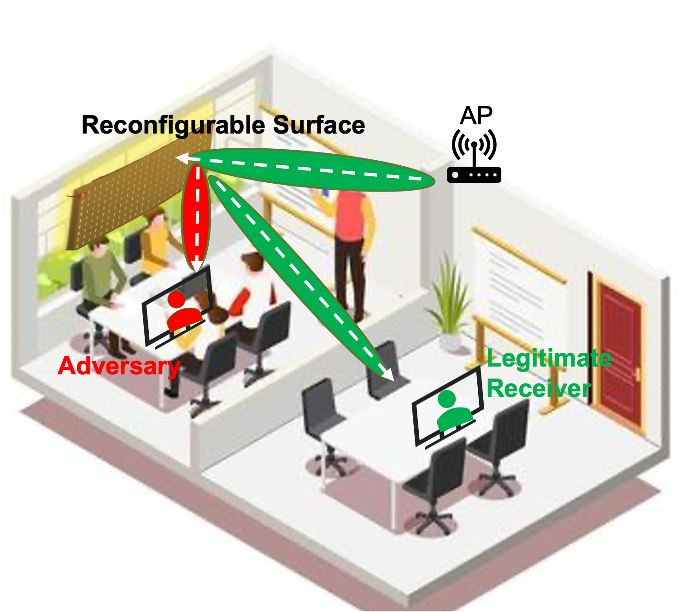

My research lies at the intersection of next-generation wireless networks, wireless
sensing, and smart device systems. I am particularly interested in creating agile, adaptable, smart, secure, and
scalable wireless systems with an emphasis on millimeter-wave (mmWave) and Terahertz (THz) networks,
providing a solution that exploits the large swath of the spectrum flexibly and incorporates novel
node architectures with unexplored devices and systems. 

## Robust and Scalable Millimeter-Wave Networks

 

Today, the GHz-scale unlicensed spectrum coupled with directional antennas can support Gbps data
rates in point-to-point links. Next-generation devices aim to scale to dense user populations via the
concurrent transmission of multiple independent data streams, i.e., downlink and uplink multi-user
MIMO. However, while the utilization of high frequencies and wide spectrum represents a significant advancement in achieving higher data rates, the challenge of ensuring robustness in the presence of human blockage and client mobility remains a significant obstacle for highly directional links. 
To address these challenges, we are actively engaged in the theoretical and experimental development of novel cross-layer techniques. 
These techniques aim to enable adaptable and resilient mm-Wave networks that can effectively scale to accommodate dense user populations.

## Agile, Adaptable, and Smart Terahertz Communication and Sensing 

 

Scaling spectrum access towards terahertz will provide a key ingredient to realize the sixth generation
and beyond of wireless networks. In this work, we develop the foundations for scaling wireless networks to
Terabits per second (Tb/sec) via coupling new advances in Terahertz-scale (THz) communication and
sensing. Indeed, different propagation characteristics, wide bandwidth, directionality, and lack of real-time adaptation prevent today's THz wireless technologies from efficiently scaling up and supporting mobile users. This project will tackle the fundamental barriers of mobile THz communication and sensing. In particular, the project will design and build practical, scalable, mobile THz wireless technologies for next-generation communications systems. 

## Smart Devices and Systems for Enhanced Coverage, Reliability, and Security
<!-- 
  -->
<!--  -->

 
 
  
Our research focuses on developing cutting-edge technologies that harness the power of intelligent surfaces to revolutionize wireless networks operating in the millimeter-wave (mmWave) and terahertz (THz) frequency ranges. These frequencies hold immense potential for ultra-high-speed connectivity and support for next-generation applications, including industrial automation, augmented and virtual reality, and cyber-physical systems. Intelligent surfaces serve as intelligent reflectors, dynamically modifying wireless channel properties to enhance coverage, reliability, and security. Through cross-layer PHY/MAC protocol design and rigorous experimental evaluations, we dynamically 
reprogram channel properties, ensuring optimal transmission conditions and mitigating challenges posed by human blockage and client mobility.

<!-- ## Physical Layer Wireless Security 
In the rapidly advancing world of wirelessly interconnected devices, security has emerged as a paramount concern. We delve into the security vulnerabilities prevalent in next-generation wireless communications, including the advanced 5G and future networks. Our focus will be on exploring the potential of smart devices and systems and leveraging the high directionality of links at mmWave and THz frequencies to bolster the resilience of wireless networks against malicious attacks despite the highly focused transmissions.-->
<!--Highly directional links are often cited as inherently resilient to passive eavesdropping despite a lack of empirical evidence. In our work, we experimentally study eavesdropping of highly directional links generated by large antenna arrays and THz antennas and demonstrate practical eavesdropping threats despite the highly focused transmissions.-->

## AI/ML for Network Management and Control 

 
 

AI and ML are pivotal in managing the complex demands of 5G and beyond, ensuring network performance aligns with the evolving needs of data-intensive applications. By harnessing these technologies, network operators attain unparalleled levels of automation, scalability, and intelligence in network management. Our research is dedicated to developing AI and ML frameworks for autonomously analyzing extensive network data and creating intelligent systems that optimize performance, adapt to dynamic environments, and enhance user experiences. 
<!--predicting issues, and dynamically optimizing network parameters for various applications.-->
